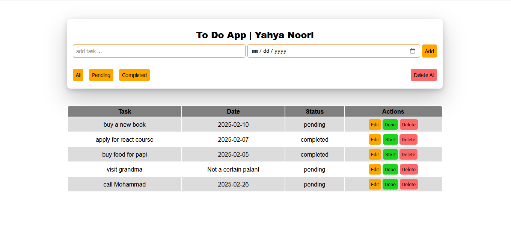

# To-Do App

A simple, intuitive, and responsive To-Do App designed to help users manage their daily tasks efficiently. Built with HTML, CSS, and JavaScript, this app offers functionalities like adding, editing, deleting, and filtering tasks, along with local storage support to keep data persistent.

## Features

- **Add New Tasks:** Quickly add tasks with an optional due date.
- **Edit Tasks:** Modify existing tasks with ease.
- **Mark as Completed:** Toggle task status between pending and completed.
- **Filter Tasks:** View all tasks, only pending, or only completed ones.
- **Delete Tasks:** Remove individual tasks or clear all tasks at once.
- **Local Storage Support:** Your tasks are saved even after refreshing the page.

## Demo




## Technologies Used

- **HTML5:** Structuring the web app.
- **CSS3:** Styling and layout design.
- **JavaScript (Vanilla):** Implementing app logic and interactivity.

## How to Use

1. **Clone the Repository:**  
   ```bash
   git clone https://github.com/your-username/todo-app.git
   ```

2. **Navigate to the Project Folder:**  
   ```bash
   cd todo-app
   ```

3. **Open `index.html` in Your Browser:**  
   You can simply double-click the `index.html` file or open it via a live server extension in your code editor.

## Folder Structure

```
├── index.html
├── style
│   └── style.css
└── js
    └── app.js
```

## Key Functionalities

- **Task Management:** Adding, editing, and deleting tasks.
- **Status Toggling:** Marking tasks as completed or pending.
- **Filtering:** Sorting tasks based on their completion status.
- **Responsive Design:** Works well on both desktop and mobile devices.

## Future Improvements

- Adding categories or tags for tasks.
- Implementing dark mode.
- Adding due date reminders.
- Syncing tasks across devices.

## Contributing

Contributions are welcome! Feel free to fork the repository, make changes, and submit a pull request.

1. Fork the Project
2. Create your Feature Branch (`git checkout -b feature/AmazingFeature`)
3. Commit your Changes (`git commit -m 'Add some AmazingFeature'`)
4. Push to the Branch (`git push origin feature/AmazingFeature`)
5. Open a Pull Request

## License

This project is licensed under the MIT License. See the [LICENSE](LICENSE) file for details.

---

**Author:** Yahya Noori  
Feel free to reach out if you have any questions or suggestions!

